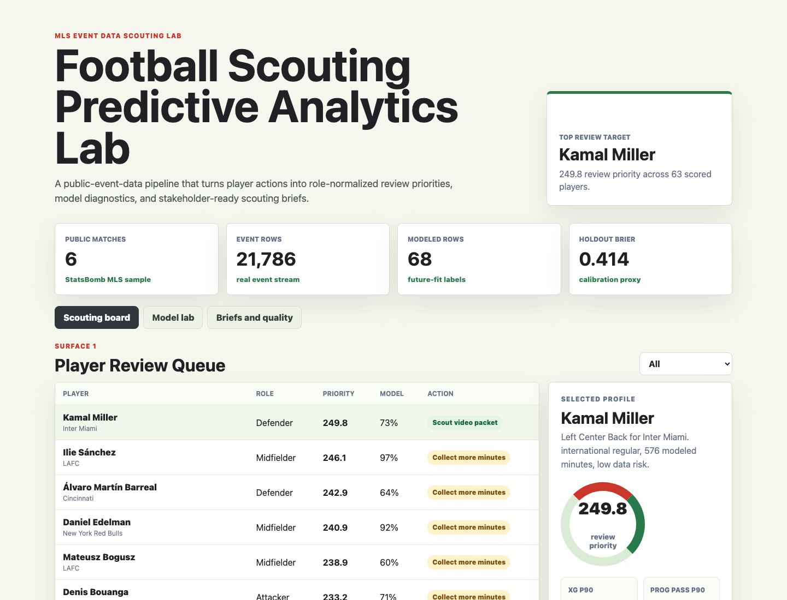
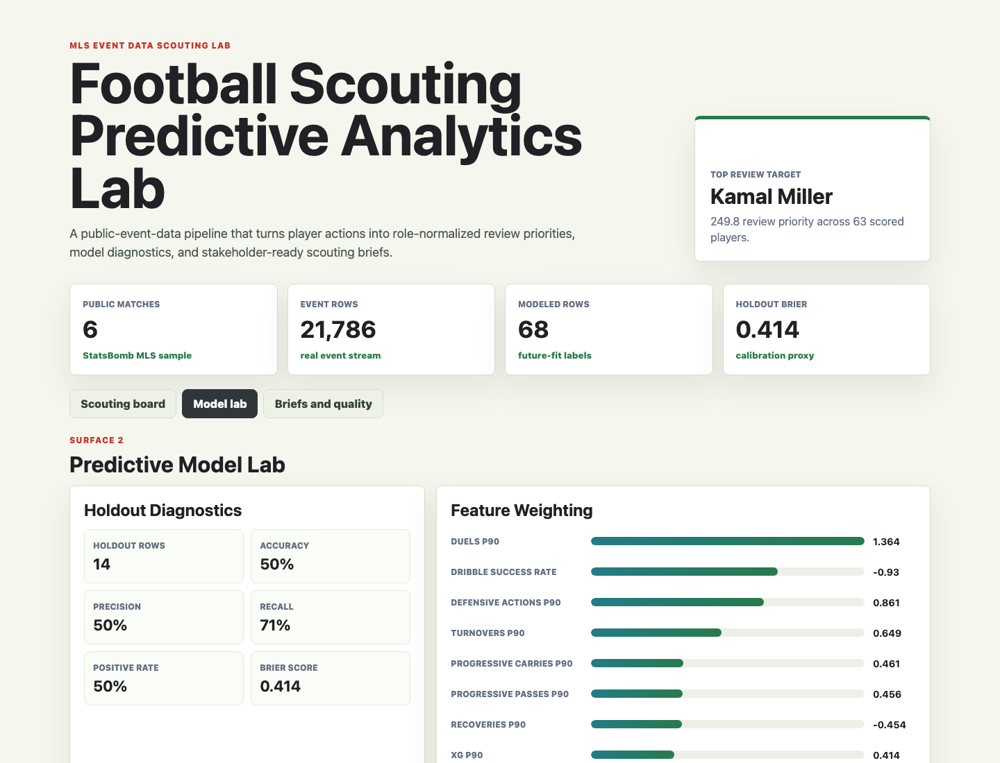
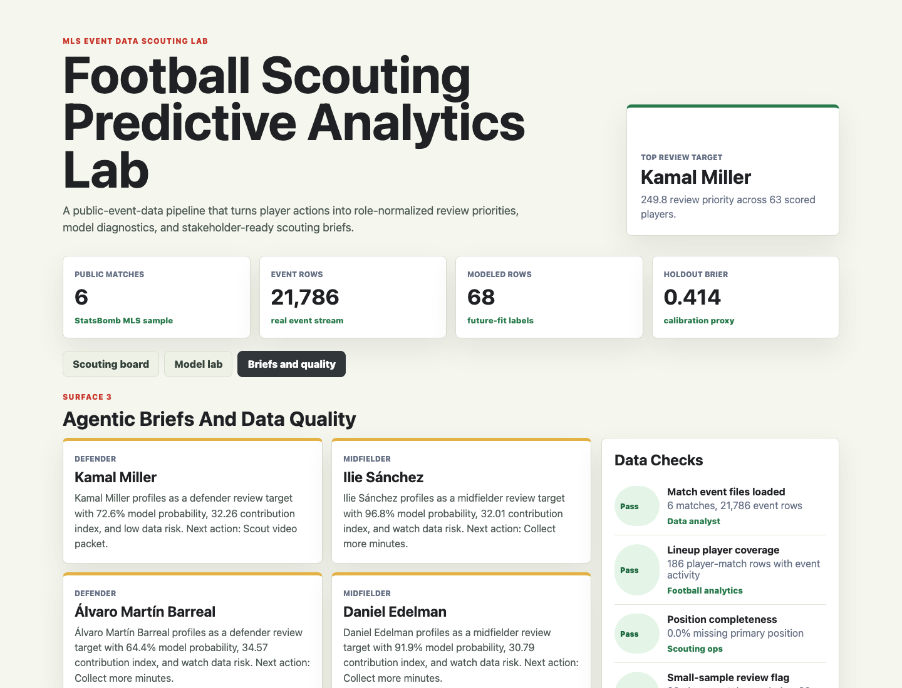

# Football Scouting Predictive Analytics Lab

An MLS football operations portfolio artifact for scouting, player profiling, predictive modeling, and stakeholder-ready analyst briefs.

The project uses public event data to build a reproducible scouting workflow: event ingestion, player-match feature engineering, a lightweight future-fit model, data quality checks, ranked player review queues, and concise briefing text for non-technical football stakeholders.

## Screenshots



**Scouting board:** Ranks player profiles by review priority, model probability, confidence, data risk, role, and next action so recruitment staff can decide which players deserve deeper video review.



**Predictive model lab:** Shows holdout diagnostics, feature weights, and role-level review distributions so the analyst can explain what is driving the model.



**Agentic briefs and data quality:** Converts the highest-priority player rows into stakeholder-ready summaries and pairs them with data checks for event coverage, lineup coverage, position completeness, and small-sample risk.

## What This Project Demonstrates

- Building football metrics from event-level data rather than relying on generic dashboard labels.
- Translating scouting and performance questions into player-match features, role-normalized scores, and review actions.
- Training an explainable predictive model against a documented proxy target.
- Communicating model output to recruitment, scouting, performance, and internal analysis stakeholders.
- Treating data quality and sample risk as part of the product, not an appendix.

## Data Strategy

The core football data comes from [StatsBomb Open Data](https://github.com/statsbomb/open-data). The artifact uses the public Major League Soccer 2023 sample, competition ID `44` and season ID `107`, with six matches and 21,786 event rows.

StatsBomb provides match, event, and lineup JSON files. The pipeline converts those files into:

- `data/match_manifest.csv`: Match-level inventory with teams, scores, event-row counts, and lineup counts.
- `data/player_match_features.csv`: Player-match metrics from shots, xG, passes, progressive passes, carries, progressive carries, pressures, recoveries, defensive actions, duels, dribbles, and turnovers.
- `analysis/outputs/scouting_priority_queue.csv`: Player-level shortlist with model probability, review priority, confidence, sample risk, and next action.
- `analysis/outputs/model_diagnostics.json`: Holdout metrics, role medians, target definition, and feature weights.
- `analysis/outputs/data_quality_checks.csv`: Data checks for source coverage and workflow readiness.
- `analysis/outputs/agentic_scouting_briefs.md`: Generated scouting briefs for the top review targets.
- `analysis/outputs/app_payload.json`: UI-ready payload generated from the same analysis outputs.

Synthetic workflow metadata is limited to analyst-facing labels such as review action, squad phase, confidence band, and data-risk status. Those fields model how a football operations analyst might package public event findings for a stakeholder review. They are not presented as real club decisions or real private scouting notes.

## Model Method

The model is a small logistic regression implemented with Python standard libraries. It is intentionally explainable and portable.

Target definition:

- Each player-match row is paired with the player's next available appearance.
- The positive class is whether the next appearance clears the role median contribution index.
- The contribution index combines xG, progressive passing, progressive carrying, pressure, defensive actions, dribble success, and turnover penalty.

The model is trained on repeated player appearances and then scores every player profile in the public event sample. One-match players are still visible in the queue, but they receive a small-sample risk flag and a collect-more-minutes action.

## Role Fit

This artifact maps to a football data analyst internship because it shows the work behind the surface: varied football datasets, SQL-style checks, feature engineering, predictive modeling, recruitment and scouting support, performance-style metrics, and concise communication for football operations stakeholders.

## Honest Scope

This project does create a reproducible football scouting analytics lab from public event data, with generated player features, an explainable model, three interactive surfaces, and documented limitations.

This project does not use private club data, does not claim to represent any actual club's internal scouting process, does not include paid provider data, and does not make transfer recommendations. The public MLS sample is small, so model output should be treated as a portfolio demonstration of workflow design and analytical communication.

## Run Locally

```bash
npm run fetch-data
npm run analyze
npm run start
```

Then open `http://localhost:4173`.

`npm run fetch-data` downloads only the public StatsBomb files needed for this artifact into `data/raw/statsbomb-open-data`. The generated CSV and JSON outputs are already included so the app can run immediately.
